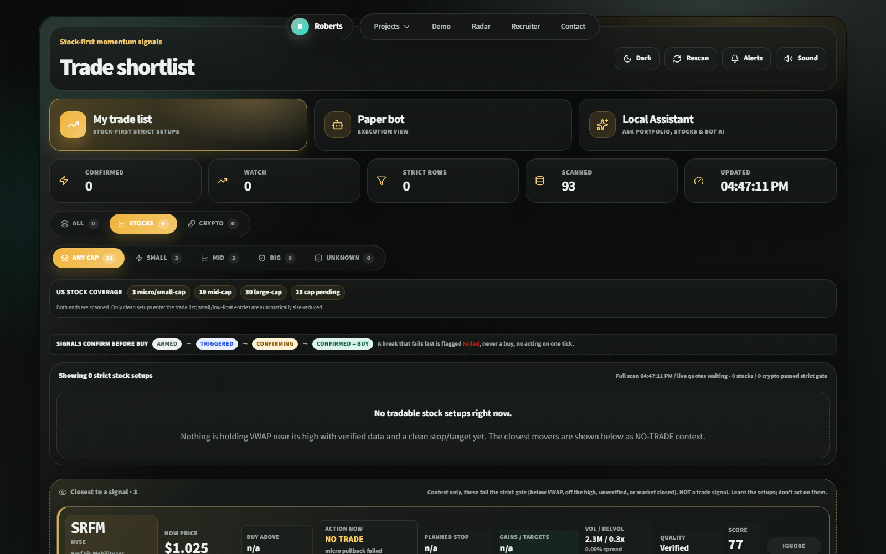

# Workbench

A React and TypeScript app where I keep the tools I've built outside my main products. It opens on a short intro page, and each tool runs in its own full-screen view.



| Tool | What it does |
| --- | --- |
| Momentum radar | Scans US stocks and crypto for strong movers, checks them against strict entry rules and shows an entry, stop and targets for anything that qualifies. A paper-trading bot on the server can act on those signals through Alpaca's paper API. |
| Strategy simulator | Runs a strategy against the market over 50 simulated markets, costs included, to see whether an edge holds up or was just luck. |
| Project Dawn scanner | An in-browser version of the passive site scanner from [project-dawn](https://github.com/Tigerstar07/project-dawn). |
| Booking email parser | Turns a messy booking email into a trip draft and flags the fields it isn't sure about. Uses made-up emails. |

The intro page also links to my two live products, [Listio](https://listio.lv/) and [Listio Drive](https://drive.listio.lv/). Their code is private.

## Running it

Needs Node.js 22 or newer.

```bash
npm ci
npm run dev
```

Then open http://127.0.0.1:5173. `npm run dev` starts Vite under a small supervisor that restarts it if it crashes, so the paper bot keeps running. Use `npm run dev:vite` for a plain dev server.

The radar works without any keys: stock movers come from Yahoo Finance's public screeners and crypto from Binance's public API. The paper bot needs Alpaca paper keys and macro event data needs a FRED key. Copy `.env.example` to `.env.local` and fill in what you want to use. `.env.local` is git-ignored.

## How the radar decides

A mover has to pass all of these before it shows up as a setup:

- it confirms over several quotes, not a single tick
- the quote is fresh, the spread is tight and the stock isn't halted
- the target still pays after spread, slippage and fees
- the position fits the per-trade and daily risk limits, and there's no macro release (CPI, FOMC and so on) inside the blackout window
- for crypto, the Alpaca price agrees with the Binance price it was spotted on

Anything that fails is still listed underneath as "closest to a signal" so you can see why it was rejected. Every paper decision is appended to a journal so the rules can be reviewed later.

## Tests

```bash
npm test        # deterministic checks for the trading and risk rules
npm run lint
npm run build
```

The tests replay fixed quotes through the gates: confirmation timing, stale and missing quotes, wide spreads, cross-venue price gaps, cost-adjusted targets, position sizing, daily loss limits, cooldowns, macro blackouts and stop management. CI runs all three on every push.

## Other bits

`integrations/openclaw-trading-ops` is a read-only plugin that lets an OpenClaw assistant ask the local radar and bot for their status. It cannot place or close orders. `scripts/` has the Windows scripts that run the bot as a scheduled task, back up its journals and keep the machine awake.

This is a public copy of a private workspace. It has no keys, trade journals or account data, and paper results here say nothing about real returns.
